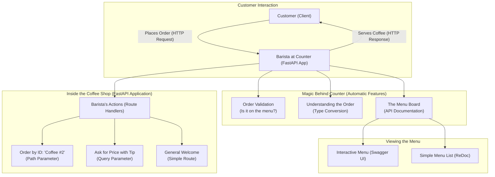

# ☕ Section 1: FastAPI Introduction - Brew Master Coffee Shop

Welcome to **FastAPI**! We'll learn the fundamentals by building a coffee shop management API that handles orders, menu items, and price calculations.

## 🎯 What You'll Learn

- FastAPI application creation and structure
- Basic routing with path and query parameters
- Automatic API documentation generation
- HTTP methods and response handling
- Error handling basics

## 🤔 What is FastAPI?

FastAPI is a modern, high-performance web framework for building APIs with Python 3.7+ based on standard Python type hints. It is built upon two major Python libraries:
- **Starlette**: A lightweight ASGI (Asynchronous Server Gateway Interface) framework/toolkit, which is ideal for building high-performance async services.
- **Pydantic**: A library for data validation and settings management using Python type annotations.

FastAPI leverages these to give you a powerful, easy-to-use tool for creating web APIs that are both fast to run and fast to code.

## ✨ Key Advantages of FastAPI

FastAPI isn't just another framework; it offers a unique combination of features that make it a standout choice for API development:

| Advantage | Description |
|-----------|-------------|
| 🚀 **High Performance** | Thanks to its ASGI core with Starlette and async support, FastAPI is one of the fastest Python frameworks available, comparable to NodeJS and Go. |
| 💻 **Fast to Code** | Developers report speed increases of 200-300% in development time. Features like automatic data conversion and documentation save countless hours. |
| 🛡️ **Robust & Reliable** | By using Pydantic for data validation, you can catch data errors early. This reduces human-induced errors by up to 40% and leads to more stable, production-ready code. |
| 🤖 **Automatic Docs** | Get interactive API documentation (Swagger UI and ReDoc) generated automatically from your code, with no extra effort. This makes testing and sharing your API incredibly easy. |
| 💡 **Intuitive & Easy** | Designed to be simple to use and learn. It provides excellent editor support (autocompletion everywhere) and leverages modern Python features, making your code clean and intuitive. |
| 🔗 **Standards-Based**| Fully compliant with open standards like OpenAPI (formerly Swagger) for API definition and JSON Schema for data structures. |

## ☕ Meet Brew Master Coffee Shop

Our coffee shop API demonstrates core FastAPI concepts through familiar business operations:

**Key Features:**
- 📋 Menu browsing and coffee details
- 💰 Price calculations with tips
- 📊 Basic business analytics

## 📊 FastAPI Application Flow



## 🚀 Core FastAPI Concepts

### 1. **FastAPI Application Setup**

```python
from fastapi import FastAPI

# Create your application instance
app = FastAPI(
    title="☕ Brew Master Coffee Shop API",
    description="Your neighborhood coffee shop, now with an API!",
    version="1.0.0"
)
```

### 2. **Basic Routing**

```python
# Simple GET endpoint
@app.get("/")
def welcome_to_coffee_shop():
    return {
        "message": "☕ Welcome to Brew Master Coffee Shop!",
        "todays_special": "Vanilla Latte with extra foam",
        "available_coffees": [
            # ...truncated for brevity, see main.py for full list
            {"id": 1, "name": "Espresso", "price": 2.50, "caffeine_level": "High"},
            {"id": 2, "name": "Cappuccino", "price": 4.00, "caffeine_level": "Medium"}
        ]
    }

# Path parameters
@app.get("/menu/coffee/{coffee_id}")
def get_coffee_by_id(coffee_id: int):
    coffee_menu = {
        1: {"name": "Espresso", "price": 2.50, "caffeine_level": "High"},
        2: {"name": "Cappuccino", "price": 4.00, "caffeine_level": "Medium"},
        3: {"name": "Latte", "price": 4.50, "caffeine_level": "Medium"},
        4: {"name": "Americano", "price": 3.00, "caffeine_level": "High"},
        5: {"name": "Frappuccino", "price": 5.50, "caffeine_level": "Low"}
    }
    return coffee_menu.get(coffee_id, {"error": "Coffee not found!"})
```

### 3. **Query Parameters in Action**

Query parameters allow flexible data filtering and optional inputs, like `tip_percentage` in our coffee calculator:

```python
@app.get("/calculate/total/{coffee_price}")
def calculate_coffee_total(coffee_price: float, tip_percentage: int = 15):
    """Calculate total cost of your coffee including tip."""
    # ... (see main.py for full implementation)
    return {"total_cost": coffee_price * (1 + tip_percentage / 100)}
```

## 📋 FastAPI Concepts Summary

| Concept | Description | Example |
|---------|-------------|---------|
| **FastAPI App** | The main application instance that handles all requests | `app = FastAPI(title="Coffee Shop API")` |
| **Path Parameters** | Variables in the URL path that identify specific resources | `/menu/coffee/{coffee_id}` |
| **Query Parameters** | Optional parameters added to the URL after `?` | `/calculate/total/4.50?tip_percentage=20` |
| **HTTP Methods** | Different request types for different operations | `@app.get()`, `@app.post()`, etc. |
| **Response Models** | Define the structure of API responses | `return {"message": "Welcome", "items": [...]}` |
| **Automatic Docs** | Self-generated interactive API documentation | Access at `/docs` or `/redoc` |
| **Type Conversion** | Automatic conversion of parameters to specified types | `coffee_id: int` converts string to integer |
| **Data Validation** | Automatic validation of input data | Returns 422 error for invalid inputs |

## 🛠️ Running Your Coffee Shop

```bash
# Install FastAPI and server
pip install fastapi uvicorn

# Start the development server
uvicorn main:app --reload

# Visit your API documentation
# 🎮 Interactive docs: http://localhost:8000/docs
# 📖 Alternative docs: http://localhost:8000/redoc
```

## 🎮 Try These Endpoints

1.  **Welcome Page (Full Menu)**: `GET /`
2.  **Get Specific Coffee**: `GET /menu/coffee/1`
3.  **Calculate Total with Tip**: `GET /calculate/total/4.50?tip_percentage=20`

## 🔥 Key FastAPI Features

### **Automatic Documentation**
FastAPI generates interactive API docs automatically from your code. No extra work needed!

### **Type Safety**
Path and query parameters are automatically converted to the correct types:
```python
@app.get("/coffee/{coffee_id}")
def get_coffee(coffee_id: int):  # Automatically converts to integer
    return {"coffee_id": coffee_id}
```

### **Data Validation**
Invalid inputs (like negative prices) return clear error messages automatically.

## 🏋️‍♀️ Practice Challenge

Extend your coffee shop with these features:

1.  **🏷️ Filter by Caffeine Level**: Add an endpoint `GET /menu/caffeine/{level}` to filter coffees by their caffeine level (e.g., "High", "Medium", "Low").
2.  **🌟 Customer Feedback**: Add a `POST /feedback` endpoint to receive customer comments and ratings for their experience.

## 💡 What's Next?

In **Section 2: Type Hints**, we'll build a game character system that shows how Python's type system makes FastAPI even more powerful and error-proof!

**Key Takeaway**: FastAPI automatically handles routing, validation, and documentation - letting you focus on building great features! ☕✨ 