# 📚 Section 2: Understanding Type Hints with a Bookstore API

Welcome to the second stop on our FastAPI journey! In this section, we'll explore one of the most powerful features of modern Python: **Type Hints**. We'll learn what they are, why they're so helpful, and how FastAPI uses them to make building APIs easier and more reliable.

## 🤔 What Are Type Hints? An Analogy

Imagine you're writing a recipe. Instead of just listing "sugar," you write "1 cup of granulated sugar." That specific instruction prevents confusion and ensures a better result.

**Type hints in Python are just like that.** They let you "hint" what type of data a variable or function should contain. Instead of a variable `price` that could be anything, you can declare `price: float`, making it clear that it should be a number.

For beginners, this is incredibly helpful because:
-   **It prevents common errors**: You can't accidentally put text where a number should be.
-   **It makes code easier to read**: You and others can immediately understand what kind of data the code is working with.
-   **It enables powerful editor features**: Your code editor can give you better autocompletion and error-checking.

## 📊 How FastAPI Uses Type Hints: A Visual Guide

FastAPI takes type hints to the next level by using them to **automatically validate incoming data** and **generate documentation**. Our Bookstore API provides a perfect example of this.

Here’s a visual of what happens when we try to add a new book:

```mermaid
graph TD
    subgraph "Your Browser"
        A[/"Client sends<br/>POST /books/ request<br/>with JSON data"/]
    end

    subgraph "FastAPI Server"
        B(FastAPI receives the request)
        C{{"Checks JSON data<br/>against 'Book' model's<br/>type hints"}}
        D["✅ Data is valid!<br/>(e.g., price is a number)"]
        E["❌ Data is invalid!<br/>(e.g., price is text)"]
        F[Executes the 'add_book' function]
        G[Automatically sends a<br/>'422 Unprocessable Entity'<br/>error response back to client]
    end

    A --> B
    B --> C
    C -- Matched --> D
    C -- Mismatched --> E
    D --> F
    E --> G
```


This diagram shows that you don't have to write any code to check if the `price` is a number—FastAPI does it for you, all because of the `price: float` type hint!

##  dissected The Bookstore Code (`main.py`)

Let's break down how type hints are used in our example.

### 1. The `Book` Model: Our Data Blueprint

The `Book` class defines the structure of a book. It inherits from Pydantic's `BaseModel`, which is what gives FastAPI its data validation superpowers.

```python
class Book(BaseModel):
    title: str              # Must be text
    author: str             # Must be text
    genre: BookGenre        # Must be a valid genre from our Enum
    price: float            # Must be a number (e.g., 19.99)
    published_year: int     # Must be a whole number (e.g., 2023)
    is_bestseller: Optional[bool] = False # Can be True, False, or not provided at all
```

- Each line declares a field and its expected type.
- `Optional[bool]` means the `is_bestseller` field is not required. If it's not included in a request, it will default to `False`.

### 2. The API Endpoints: Our Actions

The endpoints use these type hints to define their inputs and outputs.

```python
# Endpoint to add a book
@app.post("/books/")
def add_book(book: Book) -> Dict[str, Any]:
    # ...
```
-   `book: Book`: This tells FastAPI that the request body for this endpoint must match the structure of our `Book` model. This is where the magic happens!
-   `-> Dict[str, Any]`: This is a hint for the return value, indicating the function will return a dictionary.

```python
# Endpoint to list books
@app.get("/books/")
def list_books(genre: Optional[BookGenre] = None) -> List[Book]:
    # ...
```
- `genre: Optional[BookGenre] = None`: This defines an optional query parameter. It can only be one of the `BookGenre` enum values, but it doesn't have to be provided.
- `-> List[Book]`: This tells developers (and tools) that the function will return a list, where each item in the list is a `Book` object.

## 📋 Type Hints Summary Table

Here’s a quick reference for the type hints used in our Bookstore API:

| Type Hint | Example in Code | What it Means for a Beginner |
| :--- | :--- | :--- |
| **`str`** | `title: str` | The value must be text, like `"The Hobbit"`. |
| **`int`** | `published_year: int` | The value must be a whole number, like `1937`. |
| **`float`** | `price: float` | The value must be a number, like `19.99`. |
| **`bool`** | `is_bestseller: bool` | The value must be either `True` or `False`. |
| **`Enum`** | `genre: BookGenre` | The value must be one of the pre-defined choices. |
| **`Optional[T]`** | `Optional[bool]` | The field is not required. It can be of type `T` or `None`. |
| **`List[T]`** | `-> List[Book]` | The function will return a list of items of type `T`. |
| **`BaseModel`**| `class Book(BaseModel):` | Defines a structured object with its own set of type hints. |

## 🛠️ Running the Demo

To see everything in action, run the server from your terminal:

```bash
cd 02-type-hints
uvicorn main:app --reload
```

Then, open your browser and go to **[http://localhost:8000](http://localhost:8000)**. Use the web interface to add books with both valid and invalid data to see the automatic validation work!

## 🚀 What's Next?

Now that you've seen how powerful type hints are, we'll dive deeper in **Section 3: Pydantic**. We'll learn how to create more complex data models and add custom validation logic, building directly on the concepts from this section. 